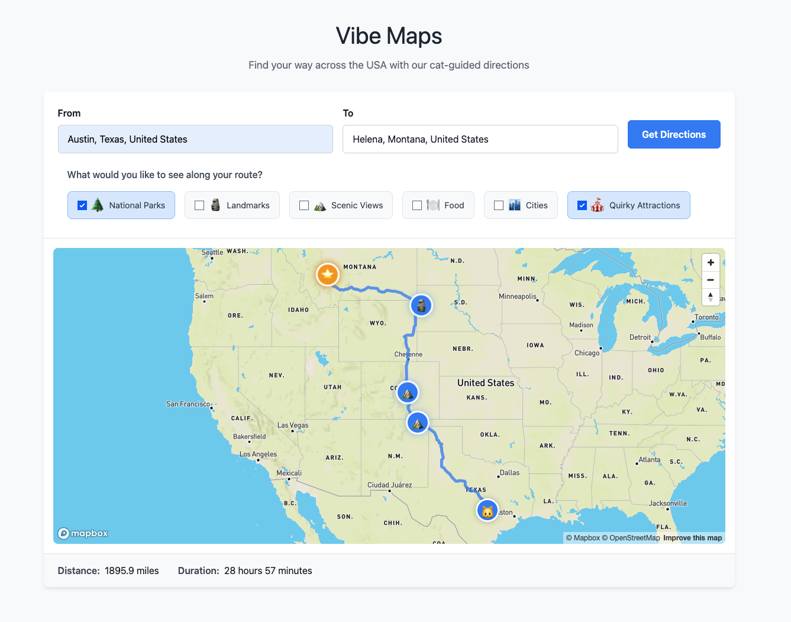

# Vibe Maps

A web application for finding directions between locations in the USA with a fun cat-themed UI.

## Features

- 🗺️ Interactive map powered by Mapbox GL JS
- 🔍 Location autocomplete for origin and destination
- 🚗 Driving directions between locations in the USA
- 🐱 Cat-themed map markers
- 📏 Distance and travel time information
- 📱 Responsive design

## Technical Details

This application is built with:

- **Svelte/SvelteKit** - Frontend framework
- **TypeScript** - Type-safe JavaScript
- **Mapbox GL JS** - Map visualization
- **Mapbox Directions API** - Route calculations
- **GraphQL** - Data fetching (via Apollo Client)
- **TailwindCSS** - Styling

## Getting Started

### Prerequisites

- Node.js (v16 or later)
- pnpm (recommended) or npm
- A Mapbox account and API token
- An Unsplash developer account and API access key

### Installation

1. Clone the repository:

```bash
git clone https://github.com/yourusername/vibe-maps.git
cd vibe-maps
```

2. Install dependencies:

```bash
pnpm install
```

3. Create a `.env` file in the root directory with your API keys:

```
VITE_MAPBOX_ACCESS_TOKEN=your_mapbox_access_token_here
VITE_UNSPLASH_ACCESS_KEY=your_unsplash_access_key_here
```

4. Getting the API keys:
   - **Mapbox API Key**: Register at [mapbox.com](https://www.mapbox.com/) and create an access token
   - **Unsplash API Key**: Register at [unsplash.com/developers](https://unsplash.com/developers) and create an application

### Development

Run the development server:

```bash
pnpm run dev
```

Open your browser and navigate to `http://localhost:5173`.

### Building for Production

Build the project:

```bash
pnpm run build
```

Preview the production build:

```bash
pnpm run preview
```

## Usage

1. Enter a starting location in the "From" field
2. Enter a destination in the "To" field
3. Click "Get Directions"
4. View the route on the map and see distance/duration information

## Limitations

- Directions are available only for locations within the USA
- Only driving directions are supported
- Some rural or new addresses may not be found by the geocoder

## License

This project is licensed under the MIT License - see the LICENSE file for details.

## UI


